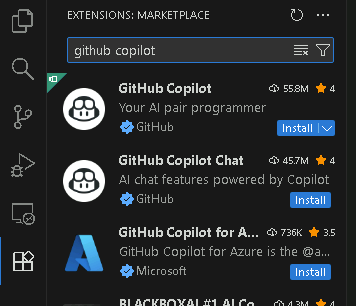

# Exercise 1 - Lab Overview and Setup

#### Duration: 15 minutes

## Overall Lab Objectives

These hands-on labs are designed to give developers practical experience using **GitHub Copilot** as an AI-powered assistant throughout the Software Development Life Cycle (SDLC). You will explore how GitHub Copilot can improve developer productivity, code quality, and collaboration, from feature planning and prototyping to implementation, code review, and customization.

Through a series of guided, real-world exercises, you will learn how to:
- Understand GitHub Copilot's role across all phases of the SDLC
- Use AI-powered code completions directly within the IDE
- Leverage GitHub Copilot Chat in Ask, Edit, and Agent modes
- Explore GitHub Copilot Spaces for collaborative development
- Delegate tasks to the GitHub Copilot coding agent to multiply development impact
- Optimize GitHub Copilot performance using Custom Instructions and Prompt Files
- Understand engineering best practices for AI-assisted development

> [!IMPORTANT]
> Throughout this lab you will work on a variety of tasks using your new best friend GitHub Copilot. At times there may be things that don't work as expected, and that's ok! Copilot is here to help in all aspects of our work. So if you encounter an issue while working through a lab try asking Copilot if it can help you solve the problem. Throw the error message into the chat, or link Copilot to an problem in the command line output. You might be surprised at the thing Copilot is able to help you solve.

## Welcome to PixelPerfect Gallery

📸 **Your Mission: Build the perfect photo gallery experience!**

Congratulations! You've just been hired as a software developer at **PixelPerfect Gallery**, an innovative startup that's transforming how photographers showcase and manage their portfolios online. Your company specializes in creating beautiful, professional photo gallery and portfolio applications that help photographers, artists, and creative professionals present their work to the world.

### Your Role

As a new developer on the team, you'll be working on extending the functionality of the photo gallery application and ensuring that it follows best practices. The company has recently adopted **GitHub Copilot** as part of its development workflow, and you'll be learning how to leverage this AI-powered assistant to accelerate your productivity and code quality.

### The Challenge Ahead

Throughout this lab, you'll help PixelPerfect Gallery tackle real development challenges:
- Understanding and navigating the existing codebase effectively
- Enhancing features across critical application components
- Planning and implementing new gallery features and functionality
- Maintaining high code quality standards across the development team
- Collaborating effectively using AI-assisted development tools

Your manager has emphasized that delivering great user experiences is crucial in the competitive creative tools space, but code quality and developer productivity cannot be compromised. This is where GitHub Copilot becomes your secret weapon, helping you build better features faster while maintaining the high standards that creative professionals expect from PixelPerfect Gallery.

Let's get started and create something beautiful! 📷

## Setting up Your Development Environment

The first thing to do is to make sure that you create your own copy of this repository so that you can keep all of the work you do in this training.

This repository is set up as a template, so you can easily create your own copy from it!

1. From the `Code` tab of the repository click the green `Use this template` button in the top right.
2. Select `Create a new repository`
3. Here you select how you want to create the repository.
   - Owner: select either yourself or an organization you have access to
   - Visibility: select whatever option you prefer. (Note: for users in an EMU you will not be able to select public as an option)
   - Do not input anything for the Copilot prompt

### Option A: GitHub Codespaces (Recommended)

The fastest way to get started is using GitHub Codespaces:

1. Navigate to the repository on GitHub
2. Click the **"Code"** button on the repository page
3. Select the **"Codespaces"** tab
4. Click **"Create codespace on main"** (or your current branch)
5. Wait for the codespace to build and start

The codespace will automatically:
- Configure GitHub Copilot and essential VS Code extensions
- Provide a fully configured development environment
- Install dependencies and start the development server in the `pixelperfect-gallery` directory

If you need to manually start the server:
```bash
cd pixelperfect-gallery
npm run dev
```

Access the application at the forwarded port URL provided in the terminal (typically `http://localhost:3000`).

### Option B: Local Development

If you prefer to work locally:

1. **Prerequisites:**
   - Node.js v18 or newer
   - npm (or yarn, pnpm, bun)
   - Git
   - Visual Studio Code (recommended)

2. **Clone the repository:**
   ```bash
   git clone https://github.com/<YOURORGANIZATION>/<YOURREPOSITORYNAME>.git
   cd <YOURREPOSITORYNAME>/pixelperfect-gallery
   ```

3. **Install dependencies:**
   ```bash
   npm install
   ```

4. **Start the development server:**
   ```bash
   npm run dev
   ```

5. **Open the application:**
   - Navigate to [http://localhost:3000](http://localhost:3000) in your browser

## Installing GitHub Copilot

1. **Open Visual Studio Code** (or your codespace)

2. **Install the GitHub Copilot extension:**
   - Click on the **Extensions** icon in the left sidebar (or press `Ctrl+Shift+X` / `Cmd+Shift+X`)
   - Search for **"GitHub Copilot"**
   - Click **Install** on the "GitHub Copilot" extension
   - Also install **"GitHub Copilot Chat"** if not automatically installed

   

3. **Sign in to GitHub:**
   - When prompted, sign in to your GitHub account
   - Authorize the GitHub Copilot extension

4. **Verify installation:**
   - Look for the GitHub Copilot icon in the bottom-right status bar
   - Open the Copilot Chat panel (click the chat icon in the left sidebar or use the keyboard shortcut)
   - You should see the chat interface ready to use

   

## Exploring the Application

Now that your environment is set up, let's explore what you'll be working with:

1. **View the running application:**
   - Open [http://localhost:3000](http://localhost:3000) in your browser
   - Browse through the different pages (Home, Gallery, Upload, Admin)
   - Try interacting with features like photo filtering and the upload zone

2. **Explore the codebase structure:**
   ```
   pixelperfect-gallery/
   ├── src/
   │   ├── app/             # Next.js 15 App Router pages
   │   │   ├── page.tsx     # Home page
   │   │   ├── gallery/     # Gallery page
   │   │   ├── upload/      # Upload page
   │   │   └── admin/       # Admin dashboard
   │   ├── components/      # Reusable React components
   │   │   ├── ui/          # UI components
   │   │   ├── gallery/     # Gallery-specific components
   │   │   └── upload/      # Upload-specific components
   │   └── lib/             # Utility functions and mock data
   └── public/              # Static assets
   ```

3. **Key technologies in use:**
   - **Next.js 15** - React framework with App Router
   - **TypeScript** - Type-safe JavaScript
   - **Tailwind CSS** - Utility-first CSS framework
   - **Framer Motion** - Animation library
   - **Radix UI** - Accessible component primitives

## Verifying Your Setup

Let's make sure everything is working correctly:

1. **Check that the application builds:**
   ```bash
   cd pixelperfect-gallery
   npm run build
   ```

2. **Run the linter:**
   ```bash
   npm run lint
   ```

3. **Verify GitHub Copilot is active:**
   - Open any `.tsx` file in the `pixelperfect-gallery/src/` directory
   - Start typing a comment like `// Function to calculate`
   - You should see Copilot suggestions appear (ghost text in gray)

## Summary

In this lab, you successfully:
- ✅ Set up your development environment
- ✅ Installed and configured GitHub Copilot
- ✅ Explored the Photo Gallery application
- ✅ Verified your setup is working correctly

You're now ready to dive into using GitHub Copilot to explore and enhance the PixelPerfect Gallery application!

## Coming up next...

In the next lab, you'll learn to explore codebases with GitHub Copilot:
- Discover available Copilot features and commands
- Understand project structure and technologies using AI assistance
- Navigate code components efficiently
- Master effective strategies for onboarding to new projects
